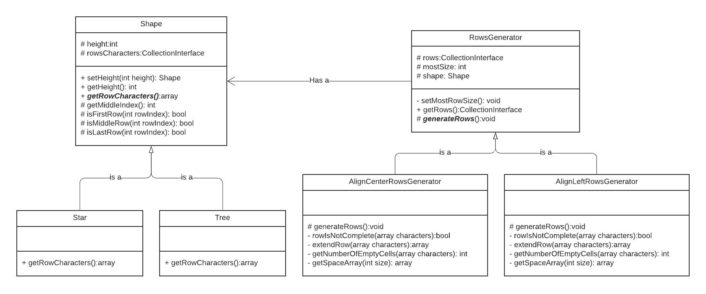
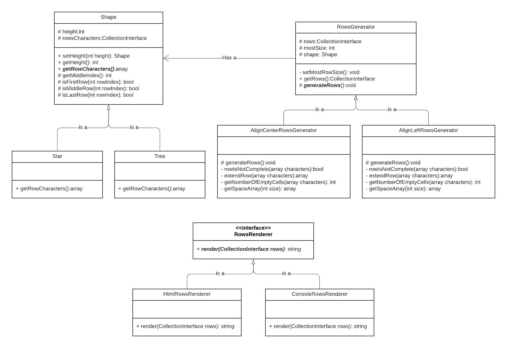

  
# Christmas 
The sample project to generate the shapes.    
    
# Table of contents
- [Installation](#installation)
  - [Step 1](#step-1)
  - [Step 2](#step-2)
- [How to generate](#how-to-generate)
  - [Generate in web pages](#generate-in-web-pages)
  - [Generate in console](#generate-in-console)
- [The project structure](#the-project-structure)
   - [The Fox mini framework](#the-fox-mini-framework)
   - [The project](#the-project)
   - [The generator logic](#the-generator-logic)
      - [The Shape](#the-shape)
      - [The ShapeGenerator](#the-shapegenerator)
         - [AlignCenterShapeGenerator](#aligncentershapegenerator)
         - [DoubledAlignCenterShapeGenerator](#doubledaligncentershapegenerator)
      - [The RowRenderer](#the-rowrenderer)
      - [Conclusion](#conclution)
- [UML diagram](#uml-diagram)

# Installation
### Step 1:
Create a `.env` file and put these data into it:
```
DATABASE=mysql
MYSQL_HOST=localhost
MYSQL_USERNAME=root
MYSQL_PASSWORD=
MYSQL_PORT=3306
MYSQL_DATABASE=fox
APP_DEBUG=true
```
For more information please refer to: [Environment variables](https://github.com/H-Gh/fox-framework#environment-variables)

> This project will not use the database. But for running the application they must be defined.

### Step 2:
Install the composer:
``` composer install ```

# How to generate
In two ways you can generate the shapes. First generating via web pages and second using the console.     
    
#### Generate in web pages 
To generate the shape on the web page open below URL and follow the page.    
``` http://localhost/christmas/generator ```    
 
#### Generate in console
Simply run this command:    
``` php console shape:generate tree ```
> ***Note***: This command accepts two arguments. The first and required one is `shapeName`. For now, there are two options here: `tree` and `star`. The second and optional argument is the `height` of the shape. The available options for height are: `5`, `7`, `11`, `15`    
    
# The project structure
 The whole code contains 3 part:    
- The Fox mini framework    
- The project    
- The generator logic    
    
## The Fox mini framework 
The Fox mini framework is a framework that provides the basic utilities for any web-based project. It is not a commercial project. It is just created to run simple projects like this.    
You can see the detail of this mini framework here:    
    
[Fox mini framework](https://github.com/H-Gh/fox-framework)    
    
## The project
A project that creates the basic settings for the Fox mini framework. It set up the folder structure, create a sample env file, and some examples to get familiar with the framework.    
To see more about the project go to:    
    
[Fox project](https://github.com/H-Gh/fox)    
    
## The generator logic 
The most relative section for this project lies here. The main duty of this project is to generate the shapes in web pages and console. You can create any shape that you want, but for this step, there are just two shapes. A `Star` and a `Tree`.    
    
But, how the project works. Before we talk about the project, let's know more about the basic concepts.
There are 3 main concepts. The `Shape`, the `ShapeGenerator`, and the `RowRenderer`.  
  
### The Shape  
This class holds all data of the shapes. Like their `height`, the `character(s)` pattern per row, and some other stuff. No one else knows about `character(s)` pattern unless the `Shape` itself.  
At this moment we have two `Shape`. `Star` and `Tree`.
So as a sample for the `Star` shape with the `height` of `5`, the rows will be something like this:  
```  
    +       // The first row contains just ["+"]
    *       // The second row contains just ["*"]
 +*****+    // The third row contains ["+","*","*","*","*","*","+"]  
    *       // The fourth row contains just ["*"]
    +       // The fifth row contains just ["+"]
	        // The pattern of rows:
	        // [["+"],["*"],["+","*","*","*","*","*","+"]["*"],["+"]]  
```  
Does anybody else know how a `Star` must be rendered? Absolutely no!  
Another question appears here. Is the `Shape` violating the `Single Responsibility Principle`? No, because the `Single Responsibility Principle` says:  
> Every class must have only one job to do.  
  
Or  
> A class must have one reason to change.  
  
Now, The only job that the shape is doing is holding the data. Holds the `height` of shape, and the `pattern` of rows. Nothing else. So it doesn't violet the `Single Responsibility Principle`.  

You can define your own shapes as many as you want.
  
### The ShapeGenerator  
Ok, we have the visible character of the rows, but not the entire row with visible and invisible characters. The duty of the `ShapeGenerator` is creating the rows that contains visible and invisible (spaces) characters. We can generate those patterns in many ways! First, let's start with the normal way for the `Star` shape.  
#### AlignCenterShapeGenerator  
The `Star` shape must be aligned center.  So the `AlignCenterShapeGenerator` will update the pattern and add the spaces to the rows to make sure that the `character(s)` of that rows surrounded by the spaces to be in the center of the row.  
Imagine a 5 row `Star` shape. So the biggest row size is `7` (number of columns). The first row has just one `character` which is `+`. The `AlignCenterShapeGenerator` will add `3` spaces before `+` and after it to make sure the size of the first row is `7` and the `+` is in the middle of the characters.  
By this scenario, all the rows will rebuild and all of them will be aligned in the center.  
```  
[
   [" "," "," ","+"," "," "," "],
   [" "," "," ","*"," "," "," "],
   ["+","*","*","*","*","*","+"],
   [" "," "," ","*"," "," "," "],
   [" "," "," ","+"," "," "," "]
]
```  
#### DoubledAlignCenterShapeGenerator  
The question is here, The `Star` shape should be rendered as center-aligned shape, why we separated the `ShapeGenerator` from `Shape`? Two reasons exist here. First `Single Responsibility Principle` and second what if you what each row rendered twice? like this:  
```  
[  
    [" "," "," ","+"," "," "," "],
    [" "," "," ","+"," "," "," "],
    [" "," "," ","*"," "," "," "],
    [" "," "," ","*"," "," "," "],
    ["+","*","*","*","*","*","+"],
    ["+","*","*","*","*","*","+"],
    [" "," "," ","*"," "," "," "],
    [" "," "," ","*"," "," "," "],
    [" "," "," ","+"," "," "," "],
    [" "," "," ","+"," "," "," "]
]  
```  
If the `ShapeGenerator` exists inside the `Shape` you have to open the shape and then edit it that you violet the `Open Close Principle`. Of course, there is another way to do this that is `Dependency Injection`. But by using this concept, you will violet the `Single Responsibility Principle`. Why? becuase the shape now do more than one job, First holding the data and second generating the rows.  

### The RowRenderer
Ok, now we generated the shape. It's time to render it everywhere we want! On the web page or in a console. So we need a new concept. `ShapeRenderer` is our new concept. The `ShapreRenderer` is abstract, and some other classes will extend it. 
At this moment we have `HtmlRowsRenderer` and `ConsoleRowsRenderer` as concrete classes of `RowsRenderer`. What they do, it's not our concern. We just expect them to convert rows to some printable formats.

### Conclusion  
We have the `Shape` and the `ShapeGenerator`. Both of them are abstracts and have some `concreate` classes. Let's draw the class diagram.
  


Ok as we can see, both the `Shape` and `ShapeGenerator` as abstract classes have two concrete classes and the `ShapeGenerator` has a `Shape` object. Super! It is a `Bridge Design Pattern`. It reduces the number of classes that we might have by bypassing the `Cartesian product`. Learn more about it [here](https://en.wikipedia.org/wiki/Cartesian_product).

As a final step, now we have the generated rows, we will send rows to `RowRenderer` based on the environment, and it will convert the rows to a printable format. We can send the rows to `HtmlRowsRenderer` to render as an `HTML` structure or inject it to `ConsoleRowsRenderer` to render it as console style. You can define your own `RowsRenderer` too.

## UML diagram
